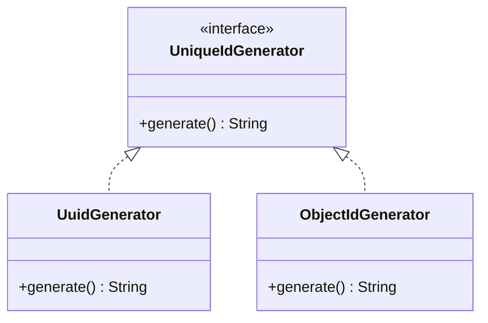
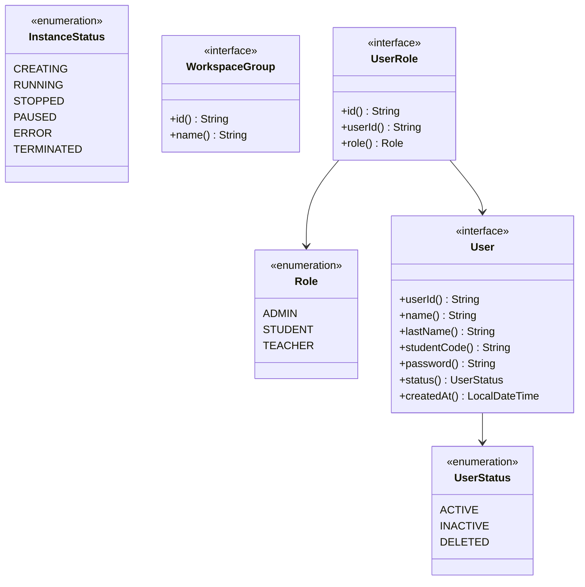
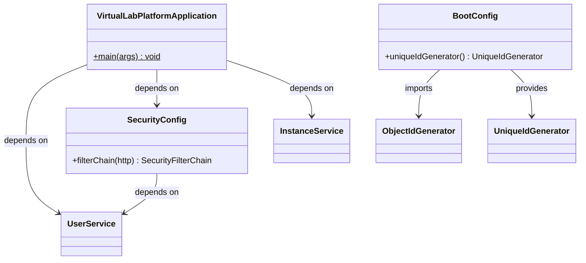

# Virtual Lab Platform — System Architecture

## High-Level Overview

The Virtual Lab Platform is a modular monolith that provides remote management and secure virtualization of computational resources through containers. Built on Java 21 and Spring Boot 4.0, the system divides its responsibilities across four Gradle sub-projects: **commons**, **users**, **instances**, and **boot**. Each business module (users, instances) follows a layered, hexagonal-inspired architecture where domain contracts are defined as interfaces in an `api` package and concretely implemented by JPA entities, service operations, and REST controllers in dedicated downstream packages.

The **users** module handles identity concerns—user registration, authentication metadata, and role-based authorization (ADMIN, STUDENT, TEACHER). The **instances** module governs the full lifecycle of containerized workspaces, from provisioning through Docker to monitoring resource consumption metrics, and it links users to their instances via a many-to-many join entity. The **commons** module provides shared infrastructure, currently centering on unique-ID generation through a strategy pattern that is resolved at assembly time by the boot module.

The **boot** module acts as the application entry point and composition root: it assembles Spring Boot, configures security, scans JPA entities and repositories from both business modules, and selects the concrete `UniqueIdGenerator` implementation (`ObjectIdGenerator`) that will be injected across the entire system.

## Modules Breakdown

### Commons Module

The commons module provides shared infrastructure utilities consumed by all other modules. It is the only module with no dependency on other project modules.

**Key classes:**

| Class / Interface | Package | Responsibility |
|---|---|---|
| `UniqueIdGenerator` | `commons.type` | Strategy interface for ID generation with a single `String generate()` method |
| `UuidGenerator` | `commons.tool` | `UniqueIdGenerator` implementation backed by `UUID.randomUUID()` |
| `ObjectIdGenerator` | `commons.tool` | `UniqueIdGenerator` implementation backed by MongoDB `ObjectId` |



### Shared API Types

The `user-api-types` diagram defines cross-cutting domain contracts and enumerations that are referenced across module boundaries. These types represent the canonical shared vocabulary of the platform.

> **Note:** The `User` interface and `InstanceStatus` enumeration defined here differ from their counterparts in the module-specific diagrams. The module diagrams reflect the current implementation, while `user-api-types` represents the intended canonical type definitions. Key discrepancies are documented in the Implementation Notes section.



### Users Module

The users module manages platform identities, their roles, and authentication metadata. It depends on the commons module for ID generation.

#### API Types

Domain contracts are defined as interfaces in the `api.type` package, with enumerations for role and status classification.

| Class / Interface | Package | Responsibility |
|---|---|---|
| `User` | `api.type` | Core domain interface exposing user identity, name, credentials, and status |
| `UserRole` | `api.type` | Domain interface linking a user to a specific role |
| `Role` | `api.type` | Enumeration of system roles: `ADMIN`, `STUDENT`, `TEACHER` |
| `UserStatus` | `api.type` | Enumeration of user lifecycle states: `ACTIVE`, `INACTIVE`, `DELETED` |

#### API Services

Service contract interfaces in the `api.service` package define the bounded-context operations.

| Interface | Methods |
|---|---|
| `UserService` | `createUser`, `getUserById`, `getUserByUsername`, `getAllUsers`, `updateUser`, `deleteUser` |
| `UserRoleService` | `createUserRole`, `createUserRoles`, `getRoleByUserId`, `deleteUserRole` |

#### Data Layer

JPA entities implement the domain interfaces directly and are persisted through Spring Data repositories.

| Class / Interface | Package | Key Detail |
|---|---|---|
| `UserJpa` | `data.model` | `implements User`; mapped to `users` table; stores `id`, `name`, `lastName`, `externalCode`, `password`, `status`, `createdDate` |
| `UserRoleJpa` | `data.model` | `implements UserRole`; mapped to `user_roles` table; stores `id`, `userId`, `role` |
| `UserRepository` | `data.repository` | Extends `JpaRepository<UserJpa, String>`; provides `findByUsername`, `save`, `findById`, `findAll` |
| `UserRoleRepository` | `data.repository` | Extends `JpaRepository<UserRoleJpa, String>`; provides `findByUserId` |

#### Operation Layer

Service implementations that realize the `api.service` interfaces.

| Class | Implements | Dependencies |
|---|---|---|
| `UserServiceOp` | `UserService` | `UserRepository`, `UniqueIdGenerator`, `PasswordEncoder` |
| `UserRolesServiceOperation` | `UserRoleService` | `UniqueIdGenerator`, `UserRepository`, `UserRoleRepository` |

#### Web Layer

REST controllers and request/response DTOs exposing the user domain over HTTP.

| Class / Record | Base Path / Purpose |
|---|---|
| `UserController` | `/api/users` — CRUD for users |
| `UserRoleController` | `/api/user-roles` — role assignment |
| `CreateUserRequest` | Request DTO for user creation |
| `UpdateUserRequest` | Request DTO for user update (partial) |
| `CreateUserRoleRequest` | Request DTO for single role assignment |
| `CreateUserRolesRequest` | Request DTO for batch role assignment |
| `UserDto` | Response DTO with `static from(User)` factory |
| `UserResponse` | Response record serializing user data |

#### Users Module Diagram

```mermaid
classDiagram
    direction TB

    class User {
        <<interface>>
        +id() String
        +name() String
        +lastName() String
        +externalCode() Optional~String~
        +password() String
        +status() UserStatus
        +createdDate() LocalDateTime
    }

    class UserRole {
        <<interface>>
        +id() String
        +userId() String
        +role() Role
    }

    class Role {
        <<enumeration>>
        ADMIN
        STUDENT
        TEACHER
    }

    class UserStatus {
        <<enumeration>>
        ACTIVE
        INACTIVE
        DELETED
    }

    class UserService {
        <<interface>>
        +createUser(username, email, password, roles) User
        +getUserById(id) Optional~User~
        +getUserByUsername(username) Optional~User~
        +getAllUsers() List~User~
        +updateUser(id, user) User
        +deleteUser(id) void
    }

    class UserRoleService {
        <<interface>>
        +createUserRole(userId, role) UserRole
        +createUserRoles(userId, roles) List~UserRole~
        +getRoleByUserId(userId) List~UserRole~
        +deleteUserRole(id) void
    }

    class UserJpa {
        -String id
        -String name
        -String lastName
        -String externalCode
        -String password
        -UserStatus status
        -LocalDateTime createdDate
    }

    class UserRoleJpa {
        -String id
        -String userId
        -Role role
    }

    class UserRepository {
        <<interface>>
        +findByUsername(username) Optional~UserJpa~
        +save(user) UserJpa
        +findById(id) Optional~UserJpa~
        +findAll() List~UserJpa~
    }

    class UserRoleRepository {
        <<interface>>
    }

    class UserServiceOp {
        -UserRepository repository
        +createUser(...)
        +getUserById(...)
        +getUserByUsername(...)
        +getAllUsers()
        +updateUser(id, user)
        +deleteUser(id)
    }

    class UserRolesServiceOperation {
        -UniqueIdGenerator uniqueIdGenerator
        -UserRepository userRepository
        -UserRoleRepository userRoleRepository
        +createUserRole(...)
        +createUserRoles(...)
        +getRoleByUserId(...)
        +deleteUserRole(id)
    }

    class UserController {
        -UserService service
        +createUser(...)
        +getUserById(id)
        +getAllUsers()
        +getUserByUsername(username)
        +updateUser(id, request)
        +deleteUser(id)
    }

    class UserRoleController {
        -UserRoleService service
        +createUserRole(...)
        +createUserRoles(...)
        +getRolesByUserId(userId)
        +deleteUserRole(id)
    }

    class UserDto {
        +String id
        +String username
        +String email
        +Set~String~ roles
        +from(User user) UserDto$
    }

    class ModuleConfig

    UserJpa ..|> User
    UserServiceOp ..|> UserService
    UserRolesServiceOperation ..|> UserRoleService
    UserServiceOp --> UserRepository
    UserRolesServiceOperation --> UserRoleRepository
    UserController --> UserService
    UserRoleController --> UserRoleService
    UserDto ..> User
    UserRole --> User
    UserRole --> Role
    User --> UserStatus
```



### Instances Module

The instances module governs the full lifecycle of containerized workspaces—creation, start/stop, deletion, user assignment, and resource-metric collection. It depends on both the commons and users modules.

#### API Types

| Class / Interface | Package | Responsibility |
|---|---|---|
| `Instance` | `api.type` | Core domain interface for a virtual workspace; exposes 18 accessors covering identity, resource specs, networking, and lifecycle timestamps |
| `InstanceStatus` | `api.type` | Enumeration: `CREATED`, `STARTING`, `RUNNING`, `STOPPED`, `EXPIRED`, `DELETED` |
| `InstanceUser` | `api.type` | Join entity interface linking a user to an instance |
| `InstanceMetrics` | `api.type` | Domain interface for resource utilization snapshots (CPU, memory, disk, time) |

**`Instance` attribute breakdown:**

- **Identity:** `id`, `name`, `description` (Optional)
- **Container image:** `imageName`, `imageVersion`, `imageRegistry`
- **Resource specs:** `cpuCores`, `memoryMb`, `storageMb`, `gpuEnabled`
- **Networking:** `externalIp`, `internalIp`, `exposedPort`
- **Lifecycle:** `createdAt`, `expiresAt`, `startedAt`, `stoppedAt` (Optional), `deletedAt` (Optional), `lastAccessedAt` (Optional)
- **Status:** `status` → `InstanceStatus`

#### API Services

| Interface | Methods |
|---|---|
| `InstanceService` | `createInstance`, `startInstance`, `stopInstance`, `getInstanceById`, `getInstancesByUserId`, `deleteInstance`, `checkOwnership` |
| `InstanceMetricsService` | `getMetricsByInstanceId`, `recordMetrics` |
| `InstanceUserService` | `assignUserToInstance`, `getUsersByInstanceId`, `removeUserFromInstance` |
| `WorkspaceProvisionerService` | `createWorkspace`, `stopWorkSpace` |

#### Data Layer

| Class / Interface | Package | Key Detail |
|---|---|---|
| `InstanceJpa` | `data.model` | `implements Instance`; mapped to `instances` table; 20 fields |
| `InstanceMetricsJpa` | `data.model` | `implements InstanceMetrics`; mapped to `instance_metrics` table |
| `InstanceUserJpa` | `data.model` | `implements InstanceUser`; mapped to `instance_users` table |
| `InstanceRepository` | `data.repository` | Extends `JpaRepository<InstanceJpa, String>`; includes `findByUserId` via JPQL join |
| `InstanceMetricsRepository` | `data.repository` | `findByInstanceId` |
| `InstanceUserRepository` | `data.repository` | `findByUserId`, `findByInstanceId` |

#### Operation Layer

| Class | Implements | Dependencies |
|---|---|---|
| `InstanceServiceOperation` | `InstanceService` | `InstanceRepository`, `InstanceUserRepository`, `WorkspaceProvisionerService`, `UniqueIdGenerator` |
| `InstanceMetricsServiceOperation` | `InstanceMetricsService` | `InstanceMetricsRepository`, `UniqueIdGenerator` |
| `InstanceUserServiceOperation` | `InstanceUserService` | `InstanceUserRepository`, `UniqueIdGenerator` |
| `WorkspaceProvisionerOperation` | `WorkspaceProvisionerService` | `DockerClient` (docker-java library) |

The `WorkspaceProvisionerOperation` is the adapter that bridges the domain service layer to the Docker daemon: it creates containers with configurable resource limits and manages their lifecycle.

#### Web Layer

| Class / Record | Base Path / Purpose |
|---|---|
| `InstanceController` | `/api/instances` — full CRUD + start/stop lifecycle |
| `InstanceMetricsController` | `/api/instances/{instanceId}/metrics` — read metrics |
| `CreateInstanceRequest` | Request record for instance creation |
| `InstanceResponse` | Response record with `static from(Instance)` factory |
| `InstanceMetricsResponse` | Response record with `static from(InstanceMetrics)` factory |

#### Instances Module Diagram

```mermaid
classDiagram
    direction TB

    class Instance {
        <<interface>>
        +id() String
        +name() String
        +description() Optional~String~
        +externalIp() String
        +imageName() String
        +imageVersion() String
        +imageRegistry() String
        +cpuCores() Integer
        +memoryMb() Integer
        +storageMb() Integer
        +gpuEnabled() Boolean
        +exposedPort() Integer
        +internalIp() String
        +createdAt() LocalDateTime
        +expiresAt() LocalDateTime
        +startedAt() LocalDateTime
        +stoppedAt() Optional~LocalDateTime~
        +deletedAt() Optional~LocalDateTime~
        +lastAccessedAt() Optional~LocalDateTime~
        +status() InstanceStatus
    }

    class InstanceMetrics {
        <<interface>>
        +id() String
        +instanceId() String
        +currentCpuUsage() Double
        +currentMemoryUsage() Double
        +currentDiskUsage() Double
        +currentTimeUsage() Double
    }

    class InstanceUser {
        <<interface>>
        +id() String
        +instanceId() String
        +userId() String
    }

    class InstanceStatus {
        <<enumeration>>
        CREATED
        STARTING
        RUNNING
        STOPPED
        EXPIRED
        DELETED
    }

    class InstanceService {
        <<interface>>
    }

    class InstanceMetricsService {
        <<interface>>
    }

    class InstanceUserService {
        <<interface>>
    }

    class WorkspaceProvisionerService {
        <<interface>>
    }

    class InstanceJpa {
        -String id
        -String name
        -String description
        -String externalIp
        -String imageName
        -String imageVersion
        -String imageRegistry
        -Integer cpuCores
        -Integer memoryMb
        -Integer storageMb
        -Boolean gpuEnabled
        -Integer exposedPort
        -String internalIp
        -LocalDateTime createdAt
        -LocalDateTime expiresAt
        -LocalDateTime startedAt
        -LocalDateTime stoppedAt
        -LocalDateTime deletedAt
        -LocalDateTime lastAccessedAt
        -InstanceStatus status
    }

    class InstanceMetricsJpa {
        -String id
        -String instanceId
        -Double currentCpuUsage
        -Double currentMemoryUsage
        -Double currentDiskUsage
        -Double currentTimeUsage
    }

    class InstanceUserJpa {
        -String id
        -String instanceId
        -String userId
    }

    class InstanceRepository {
        <<interface>>
        +findById(id) Optional~InstanceJpa~
        +findAll() List~InstanceJpa~
        +findByUserId(userId) List~InstanceJpa~
        +save(instance) InstanceJpa
    }

    class InstanceMetricsRepository {
        <<interface>>
        +findByInstanceId(instanceId) List~InstanceMetricsJpa~
    }

    class InstanceUserRepository {
        <<interface>>
        +findByUserId(userId) List~InstanceUserJpa~
        +findByInstanceId(instanceId) List~InstanceUserJpa~
    }

    class InstanceServiceOperation {
        -InstanceRepository repository
        -InstanceUserRepository instanceUserRepository
        -WorkspaceProvisionerService workspaceProvisionerService
        -UniqueIdGenerator uniqueIdGenerator
        +createInstance(...)
        +startInstance(id)
        +stopInstance(id)
        +getInstanceById(id)
        +getInstancesByUserId(userId)
        +deleteInstance(id)
        +checkOwnership(instanceId, userId)
    }

    class InstanceMetricsServiceOperation {
        -InstanceMetricsRepository repository
        -UniqueIdGenerator uniqueIdGenerator
        +getMetricsByInstanceId(instanceId)
        +recordMetrics(instanceId, ...)
    }

    class InstanceUserServiceOperation {
        -InstanceUserRepository repository
        -UniqueIdGenerator uniqueIdGenerator
        +assignUserToInstance(userId, instanceId)
        +getUsersByInstanceId(instanceId)
        +removeUserFromInstance(userId, instanceId)
    }

    class WorkspaceProvisionerOperation {
        +createWorkspace(userId, isPersistent)
        +stopWorkSpace(containerId)
    }

    class CreateInstanceRequest {
        +String name
        +Optional~String~ description
        +String imageName
        +String imageVersion
        +String imageRegistry
        +Integer cpuCores
        +Integer memoryMb
        +Integer storageMb
        +Boolean gpuEnabled
        +Integer exposedPort
    }

    class InstanceResponse {
        +String id
        +String name
        +Optional~String~ description
        +String imageName
        +String imageVersion
        +Integer cpuCores
        +Integer memoryMb
        +Integer storageMb
        +Boolean gpuEnabled
        +InstanceStatus status
        +LocalDateTime createdAt
        +LocalDateTime expiresAt
        +Optional~LocalDateTime~ startedAt
        +Optional~LocalDateTime~ stoppedAt
        +Optional~LocalDateTime~ deletedAt
        +Optional~LocalDateTime~ lastAccessedAt
        +from(Instance instance) InstanceResponse$
    }

    class InstanceMetricsResponse {
        +String id
        +String instanceId
        +Double currentCpuUsage
        +Double currentMemoryUsage
        +Double currentDiskUsage
        +Double currentTimeUsage
        +from(InstanceMetrics metrics) InstanceMetricsResponse$
    }

    class InstanceController {
        -InstanceService service
        +createInstance(request)
        +getInstanceById(id)
        +getInstancesByUser()
        +startInstance(id)
        +stopInstance(id)
        +deleteInstance(id)
    }

    class InstanceMetricsController {
        -InstanceMetricsService service
        +getMetricsByInstanceId(instanceId)
    }

    class InstanceConfig

    InstanceJpa ..|> Instance
    InstanceMetricsJpa ..|> InstanceMetrics
    InstanceUserJpa ..|> InstanceUser
    InstanceServiceOperation ..|> InstanceService
    InstanceMetricsServiceOperation ..|> InstanceMetricsService
    InstanceUserServiceOperation ..|> InstanceUserService
    WorkspaceProvisionerOperation ..|> WorkspaceProvisionerService
    InstanceServiceOperation --> InstanceRepository
    InstanceServiceOperation --> InstanceUserRepository
    InstanceServiceOperation --> WorkspaceProvisionerOperation
    InstanceMetricsServiceOperation --> InstanceMetricsRepository
    InstanceUserServiceOperation --> InstanceUserRepository
    InstanceController --> InstanceService
    InstanceMetricsController --> InstanceMetricsService
    InstanceResponse ..> Instance
    InstanceMetricsResponse ..> InstanceMetrics
    Instance --> InstanceStatus
```



### Boot Module

The boot module is the composition root that assembles the Spring Boot application. It declares the entry point, configures JPA entity scanning and repository discovery across modules, sets up security policy, and selects the global ID-generation strategy.

| Class | Package | Responsibility |
|---|---|---|
| `VirtualLabPlatformApplication` | `boot` | `@SpringBootApplication` entry point with `@EntityScan` and `@EnableJpaRepositories` covering both users and instances modules |
| `SecurityConfig` | `boot.config` | `@EnableWebSecurity` configuration; disables CSRF, permits all requests |
| `BootConfig` | `boot.config` | Provides `UniqueIdGenerator` bean using `ObjectIdGenerator`, overriding the default `@Component` candidates |



### Module Integration Diagram

The following diagram shows how all modules are assembled at runtime, with dependency arrows indicating compile-time or assembly-time relationships.

```mermaid
classDiagram
    direction TB

    package virtualLabPlatformBoot {
        class VirtualLabPlatformApplication {
            +main(args)
        }
    }

    package users {
        class User
        class UserService
        class UserJpa
        class UserRepository
        class UserServiceOp
        class UserController
        class UserDto
        class ModuleConfig
    }

    package security {
        class SecurityConfig
    }

    package instances {
        class Instance
        class InstanceService
        class InstanceServiceOp
    }

    UserJpa ..|> User
    UserServiceOp ..|> UserService
    UserServiceOp --> UserRepository
    UserController --> UserService
    UserDto ..> User

    InstanceServiceOp ..|> InstanceService

    VirtualLabPlatformApplication --> UserServiceOp
    VirtualLabPlatformApplication --> SecurityConfig
    VirtualLabPlatformApplication --> InstanceServiceOp
    SecurityConfig --> UserService
```

## Relationship Summary

### Inheritance (Realization)

All domain interfaces in both modules are realized by their corresponding JPA entities—a pattern that unifies the persistence and domain models:

| Interface | Implementation |
|---|---|
| `User` | `UserJpa` |
| `UserRole` | `UserRoleJpa` |
| `Instance` | `InstanceJpa` |
| `InstanceMetrics` | `InstanceMetricsJpa` |
| `InstanceUser` | `InstanceUserJpa` |
| `UniqueIdGenerator` | `UuidGenerator`, `ObjectIdGenerator` |

Similarly, all service interfaces are realized by operation classes:

| Interface | Implementation |
|---|---|
| `UserService` | `UserServiceOp` |
| `UserRoleService` | `UserRolesServiceOperation` |
| `InstanceService` | `InstanceServiceOperation` |
| `InstanceMetricsService` | `InstanceMetricsServiceOperation` |
| `InstanceUserService` | `InstanceUserServiceOperation` |
| `WorkspaceProvisionerService` | `WorkspaceProvisionerOperation` |

### Composition / Dependency

The dependency graph flows strictly downward from the web layer through the operation layer to the data layer, with cross-cutting concerns handled by the commons module:

1. **Controllers → Service interfaces**: Controllers depend only on abstract service contracts (`UserService`, `InstanceService`, etc.), never on concrete operations.
2. **Operations → Repositories**: Each operation class composes one or more repository interfaces for persistence.
3. **Operations → `UniqueIdGenerator`**: All operation classes in both business modules depend on the commons `UniqueIdGenerator` for primary-key generation.
4. **`InstanceServiceOperation` → `WorkspaceProvisionerService`**: The instance service delegates container provisioning to the workspace provisioner, keeping Docker orchestration concerns isolated.
5. **Boot → All modules**: The boot module wires everything together—scanning entities, registering repositories, and selecting the ID-generation strategy.

### Association

- `UserRole` is associated with `User` and `Role` — composing a many-to-many relationship between users and roles.
- `InstanceUser` is associated with `Instance` — composing a many-to-many relationship between users and instances.
- `Instance` is associated with `InstanceStatus` — classifying the instance lifecycle state.
- `User` is associated with `UserStatus` — classifying the user lifecycle state.
- `UserDto` and `InstanceResponse` depend on domain types (`User`, `Instance`) through static factory methods, performing the translation from domain model to API contract.

### Cross-Module Dependencies

```
commons ←── users ←── instances
                      ↑
              boot ────┘
```

- **users → commons**: Imports `UniqueIdGenerator` in both `UserServiceOp` and `UserRolesServiceOperation`.
- **instances → commons**: Imports `UniqueIdGenerator` in all three operation classes.
- **instances → users**: Declared as a Gradle dependency, intended for future user-to-instance authorization checks (not yet leveraged at the Java level).
- **boot → commons**: `BootConfig` imports `ObjectIdGenerator` and `UniqueIdGenerator`.
- **boot → users, instances**: `VirtualLabPlatformApplication` scans JPA entities and repositories from both modules.

## Implementation Notes

### Data Types

- All entity identifiers are `String` type, generated at creation time via the `UniqueIdGenerator` strategy.
- Timestamps use `java.time.LocalDateTime` throughout both modules.
- Optional domain fields use `java.util.Optional<String>` in interfaces; JPA entities store them as nullable `String` columns.
- The `Role` and `UserStatus` enums are persisted as `STRING` in JPA, matching the enum constant names.
- The `InstanceStatus` enum is also persisted as `STRING` in JPA.

### Interface Requirements

- Every domain type (`User`, `Instance`, `InstanceMetrics`, `InstanceUser`) is defined as a Java `interface`. JPA entities implement these interfaces directly, meaning the persistence model *is* the domain model.
- Every service (`UserService`, `InstanceService`, etc.) is defined as a Java `interface`. Concrete implementations in the `operation` package realize these contracts.
- Controllers depend exclusively on service interfaces, ensuring the web layer is decoupled from persistence and business logic details.

### Strategy Pattern for ID Generation

The `UniqueIdGenerator` interface in commons has two implementations (`UuidGenerator`, `ObjectIdGenerator`). Both are annotated with `@Component` but the `BootConfig` in the boot module explicitly creates an `ObjectIdGenerator` bean, overriding any component-scanned candidate. This ensures a deterministic, globally unique ID strategy across the entire platform.

### Docker Integration

`WorkspaceProvisionerOperation` directly uses the `docker-java` client library to create and stop containers. This is the only service that interacts with external infrastructure. The provisioner currently uses a hardcoded container image (`lab-kicad:latest`) and configures resource limits (CPU, memory, disk) based on parameters supplied during instance creation.

### Security Considerations

- `SecurityConfig` currently permits all requests (no authentication or authorization enforced). This is a placeholder for future JWT-based security integration.
- `InstanceController` contains a hardcoded `userId = "current-user-id"` placeholder, intended to be replaced with JWT-based principal extraction.
- Passwords are hashed using `BCryptPasswordEncoder`, provided by `UserSecurityConfig` in the users module.
- User deletion is a soft-delete: the status transitions to `DELETED` only from `INACTIVE`. The user record is never physically removed to preserve historical associations with instances.

### JPA Repository Custom Queries

- `InstanceRepository.findByUserId(String userId)` uses a JPQL `JOIN InstanceUserJpa` query to find all instances belonging to a given user, avoiding a separate round-trip.
- `UserRepository.findByUsername(String username)` enables username-based lookup for authentication scenarios.

### Canonical vs. Implementation Type Discrepancies

The `user-api-types` shared diagram defines canonical type contracts that differ from the current module implementations in several ways. These discrepancies represent areas where the implementation has diverged from the intended shared type definitions, or where the design is still evolving:

| Aspect | `user-api-types` (Canonical) | Module Implementation |
|---|---|---|
| `User` identifier accessor | `userId()` | `id()` |
| `User` external code field | `studentCode()` (String) | `externalCode()` (Optional\<String\>) |
| `User` timestamp accessor | `createdAt()` | `createdDate()` |
| `User` password accessor | `password()` | `getPassword()` |
| `InstanceStatus` values | `CREATING`, `RUNNING`, `STOPPED`, `PAUSED`, `ERROR`, `TERMINATED` | `CREATED`, `STARTING`, `RUNNING`, `STOPPED`, `EXPIRED`, `DELETED` |
| `WorkspaceGroup` | Defined as shared type | Not yet implemented in any module |