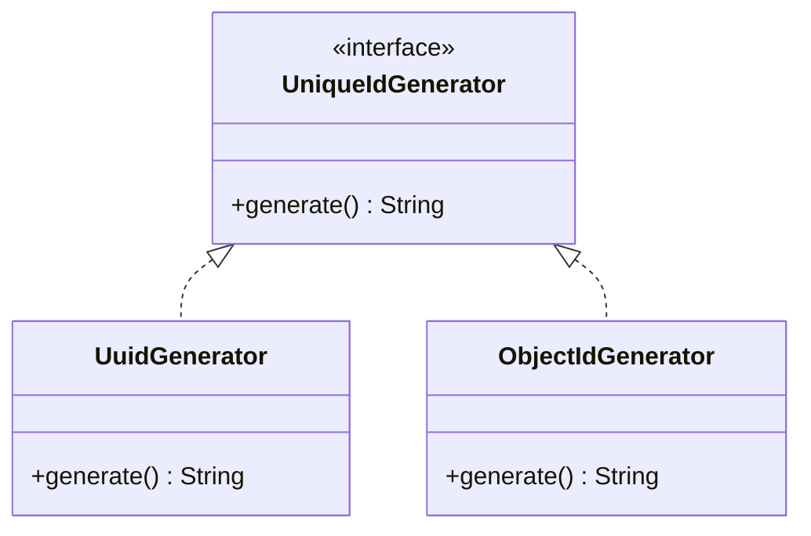
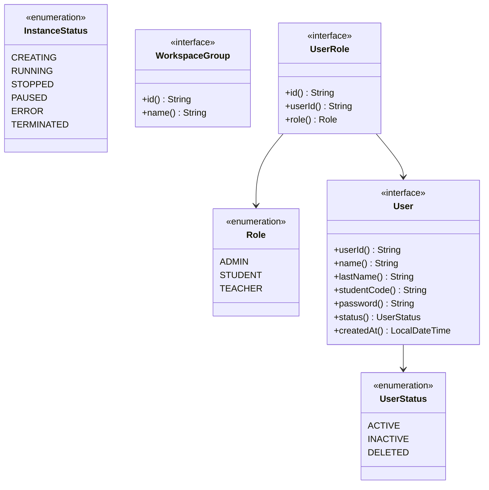
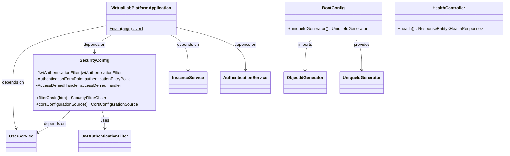

# Virtual Lab Platform — System Architecture

## High-Level Overview

The Virtual Lab Platform is a modular monolith that provides remote management and secure virtualization of computational resources through containers. Built on Java 21 and Spring Boot 4.0, the system divides its responsibilities across five Gradle sub-projects: **commons**, **users**, **instances**, **authentication**, and **boot**. Each business module (users, instances, authentication) follows a layered, hexagonal-inspired architecture where domain contracts are defined as interfaces in an `api` package and concretely implemented by JPA entities, service operations, and REST controllers in dedicated downstream packages.

The **users** module handles identity concerns—user registration, authentication metadata, and role-based authorization (ADMIN, STUDENT, TEACHER). The **instances** module governs the full lifecycle of containerized workspaces, from provisioning through Docker to monitoring resource consumption metrics, and it links users to their instances via a many-to-many join entity. The **authentication** module provides JWT-based authentication and authorization, issuing and validating access tokens, managing refresh token lifecycle (including revocation on logout), and securing API endpoints via a servlet filter. The **commons** module provides shared infrastructure, currently centering on unique-ID generation through a strategy pattern that is resolved at assembly time by the boot module.

The **boot** module acts as the application entry point and composition root: it assembles Spring Boot, configures security with JWT filter chain, scans JPA entities and repositories from all three business modules, and selects the concrete `UniqueIdGenerator` implementation (`ObjectIdGenerator`) that will be injected across the entire system.

## Modules Breakdown

### Commons Module

The commons module provides shared infrastructure utilities consumed by all other modules. It is the only module with no dependency on other project modules.

**Key classes:**

| Class / Interface | Package | Responsibility |
|---|---|---|
| `UniqueIdGenerator` | `commons.type` | Strategy interface for ID generation with a single `String generate()` method |
| `UuidGenerator` | `commons.tool` | `UniqueIdGenerator` implementation backed by `UUID.randomUUID()` |
| `ObjectIdGenerator` | `commons.tool` | `UniqueIdGenerator` implementation backed by MongoDB `ObjectId` |



### Shared API Types (Aspirational)

> **Note:** The `user-api-types` diagram below defines cross-cutting domain contracts that were intended as a canonical shared vocabulary across module boundaries. The **module-specific diagrams** in the Users and Instances sections reflect the **current implementation**. Key discrepancies between the aspirational shared types and the actual module implementations are documented in the Implementation Notes section below.



### Users Module

The users module manages platform identities, their roles, and authentication metadata. It depends on the commons module for ID generation.

#### API Types

Domain contracts are defined as interfaces in the `api.type` package, with enumerations for role and status classification.

| Class / Interface | Package | Responsibility |
|---|---|---|
| `User` | `api.type` | Core domain interface exposing user identity, name, credentials, and status |
| `UserRole` | `api.type` | Domain interface linking a user to a specific role |
| `Role` | `api.type` | Enumeration of system roles: `ADMIN`, `STUDENT`, `TEACHER` |
| `UserStatus` | `api.type` | Enumeration of user lifecycle states: `ACTIVE`, `INACTIVE`, `DELETED` |

#### API Services

Service contract interfaces in the `api.service` package define the bounded-context operations.

| Interface | Methods |
|---|---|
| `UserService` | `createUser`, `getUserById`, `getAllUsers`, `updateUser`, `deleteUser` |
| `UserRoleService` | `createUserRole`, `createUserRoles`, `getRoleByUserId`, `deleteUserRole` |

#### Data Layer

JPA entities implement the domain interfaces directly and are persisted through Spring Data repositories.

| Class / Interface | Package | Key Detail |
|---|---|---|
| `UserJpa` | `data.model` | `implements User`; mapped to `users` table; stores `id` (institutional email), `name` (first name), `lastName`, `externalCode`, `password`, `status`, `createdDate` |
| `UserRoleJpa` | `data.model` | `implements UserRole`; mapped to `user_roles` table; stores `id`, `userId`, `role` |
| `UserRepository` | `data.repository` | Extends `JpaRepository<UserJpa, String>`; provides `save`, `findById`, `findAll` |
| `UserRoleRepository` | `data.repository` | Extends `JpaRepository<UserRoleJpa, String>`; provides `findByUserId` |

#### Operation Layer

Service implementations that realize the `api.service` interfaces.

| Class | Implements | Dependencies |
|---|---|---|
| `UserServiceOp` | `UserService` | `UserRepository`, `PasswordEncoder` |
| `UserRolesServiceOperation` | `UserRoleService` | `UniqueIdGenerator`, `UserRepository`, `UserRoleRepository` |

#### Web Layer

REST controllers and request/response DTOs exposing the user domain over HTTP.

| Class / Record | Base Path / Purpose |
|---|---|
| `UserController` | `/api/users` — CRUD for users |
| `UserRoleController` | `/api/user-roles` — role assignment |
| `UsersWsOps` | Web operation interface for user and role management |
| `UsersSpringWsOps` | Web operation implementation bridging controllers to services |
| `CreateUserRequest` | Request record for user creation (includes institutional email as `id`) |
| `UpdateUserRequest` | Request record for user update (partial) |
| `CreateUserRoleRequest` | Request record for single role assignment |
| `CreateUserRolesRequest` | Request record for batch role assignment |
| `UserResponse` | Response record with `id`, `name`, `lastName`, `externalCode` (nullable), `status`, `createdDate`; uses `@JsonInclude(NON_NULL)` |
| `UserRoleResponse` | Response record with `id`, `userId`, `role` |

#### Users Module Diagram

```mermaid
classDiagram
    direction TB

    class User {
        <<interface>>
        +id() String
        +name() String
        +lastName() String
        +externalCode() Optional~String~
        +password() String
        +status() UserStatus
        +createdDate() LocalDateTime
    }

    class UserRole {
        <<interface>>
        +id() String
        +userId() String
        +role() Role
    }

    class Role {
        <<enumeration>>
        ADMIN
        STUDENT
        TEACHER
    }

    class UserStatus {
        <<enumeration>>
        ACTIVE
        INACTIVE
        DELETED
    }

    class UserService {
        <<interface>>
        +createUser(user) User
        +getUserById(id) Optional~User~
        +getAllUsers() List~User~
        +updateUser(id, user) User
        +deleteUser(id) void
    }

    class UserRoleService {
        <<interface>>
        +createUserRole(userId, role) UserRole
        +createUserRoles(userId, roles) List~UserRole~
        +getRoleByUserId(userId) List~UserRole~
        +deleteUserRole(id) void
    }

    class UserJpa {
        -String id
        -String name
        -String lastName
        -String externalCode
        -String password
        -UserStatus status
        -LocalDateTime createdDate
    }

    class UserRoleJpa {
        -String id
        -String userId
        -Role role
    }

    class UserRepository {
        <<interface>>
        +save(user) UserJpa
        +findById(id) Optional~UserJpa~
        +findAll() List~UserJpa~
    }

    class UserRoleRepository {
        <<interface>>
    }

    class UserServiceOp {
        -UserRepository repository
        -PasswordEncoder passwordEncoder
        +createUser(...)
        +getUserById(...)
        +getAllUsers()
        +updateUser(id, user)
        +deleteUser(id)
    }

    class UserRolesServiceOperation {
        -UniqueIdGenerator uniqueIdGenerator
        -UserRepository userRepository
        -UserRoleRepository userRoleRepository
        +createUserRole(...)
        +createUserRoles(...)
        +getRoleByUserId(...)
        +deleteUserRole(id)
    }

    class UserController {
        -UserService service
        +createUser(...)
        +getUserById(id)
        +getAllUsers()
        +updateUser(id, request)
        +deleteUser(id)
    }

    class UserRoleController {
        -UserRoleService service
        +createUserRole(...)
        +createUserRoles(...)
        +getRolesByUserId(userId)
        +deleteUserRole(id)
    }

    class UserResponse {
        +String id
        +String name
        +String lastName
        +String externalCode
        +UserStatus status
        +LocalDateTime createdDate
    }

    class ModuleConfig

    UserJpa ..|> User
    UserServiceOp ..|> UserService
    UserRolesServiceOperation ..|> UserRoleService
    UserServiceOp --> UserRepository
    UserRolesServiceOperation --> UserRoleRepository
    UserController --> UserService
    UserRoleController --> UserRoleService
    UserResponse ..> User
    UserRole --> User
    UserRole --> Role
    User --> UserStatus
```



### Instances Module

The instances module governs the full lifecycle of containerized workspaces—creation, start/stop, deletion, user assignment, and resource-metric collection. It depends on both the commons and users modules.

#### API Types

| Class / Interface | Package | Responsibility |
|---|---|---|
| `Instance` | `api.type` | Core domain interface for a virtual workspace; exposes 19 accessors covering identity, resource specs, networking, VNC, and lifecycle timestamps |
| `InstanceStatus` | `api.type` | Enumeration: `CREATED`, `STARTING`, `RUNNING`, `STOPPED`, `EXPIRED`, `DELETED` |
| `InstanceUser` | `api.type` | Join entity interface linking a user to an instance |
| `InstanceMetrics` | `api.type` | Domain interface for resource utilization snapshots (CPU, memory, disk, time) |
| `WorkspaceImage` | `api.type` | Immutable value object representing a workspace image entry in the catalog |
| `CatalogEntry` | `api.type` | Record combining a `WorkspaceImage` with its running instance count |

**`Instance` attribute breakdown:**

- **Identity:** `id`, `name`, `description` (Optional)
- **Container image:** `imageName`, `imageVersion`, `imageRegistry`
- **Resource specs:** `cpuCores` (int), `memoryMb` (int), `storageMb` (int), `gpuEnabled` (boolean), `exposedPort` (int), `vncPort` (int)
- **Networking:** `externalIp`, `internalIp`
- **Lifecycle:** `createdAt`, `expiresAt`, `startedAt`, `stoppedAt` (Optional), `deletedAt` (Optional), `lastAccessedAt` (Optional)
- **Status:** `status` → `InstanceStatus`

#### API Services

| Interface | Methods |
|---|---|
| `InstanceService` | `createInstance`, `startInstance`, `stopInstance`, `getInstanceById`, `getInstancesByUserId`, `deleteInstance`, `checkOwnership` |
| `InstanceMetricsService` | `getMetricsByInstanceId`, `recordMetrics` |
| `InstanceUserService` | `assignUserToInstance`, `getUsersByInstanceId`, `removeUserFromInstance` |
| `WorkspaceProvisionerService` | `createWorkspace(userId, isPersistent)`, `createWorkspace(userId, isPersistent, imageName, imageVersion, cpuCores, memoryMb, storageMb, gpuEnabled, exposedPort)`, `stopWorkSpace`, `startWorkspace`, `getContainerIp` |
| `CatalogService` | `getAvailableImages`, `getCatalog` |

#### Data Layer

| Class / Interface | Package | Key Detail |
|---|---|---|
| `InstanceJpa` | `data.model` | `implements Instance`; mapped to `instances` table; 21 fields |
| `InstanceMetricsJpa` | `data.model` | `implements InstanceMetrics`; mapped to `instance_metrics` table |
| `InstanceUserJpa` | `data.model` | `implements InstanceUser`; mapped to `instance_users` table |
| `InstanceRepository` | `data.repository` | Extends `JpaRepository<InstanceJpa, String>`; includes `findByUserId` via JPQL join, `countByImageNameAndStatusNot` |
| `InstanceMetricsRepository` | `data.repository` | `findByInstanceId` |
| `InstanceUserRepository` | `data.repository` | `findByUserId`, `findByInstanceId` |

#### Operation Layer

| Class | Implements | Dependencies |
|---|---|---|
| `InstanceServiceOperation` | `InstanceService` | `InstanceRepository`, `InstanceUserRepository`, `WorkspaceProvisionerService`, `UniqueIdGenerator` |
| `InstanceMetricsServiceOperation` | `InstanceMetricsService` | `InstanceMetricsRepository`, `InstanceRepository`, `UniqueIdGenerator` |
| `InstanceUserServiceOperation` | `InstanceUserService` | `InstanceUserRepository`, `UniqueIdGenerator` |
| `WorkspaceProvisionerOperation` | `WorkspaceProvisionerService` | `DockerClient` (docker-java library) |
| `CatalogServiceOperation` | `CatalogService` | `WorkspaceImageProperties`, `InstanceRepository` |

The `WorkspaceProvisionerOperation` is the adapter that bridges the domain service layer to the Docker daemon: it creates containers with configurable resource limits and manages their lifecycle.

#### Web Layer

| Class / Record | Base Path / Purpose |
|---|---|
| `InstanceController` | `/api/instances` — full CRUD + start/stop lifecycle |
| `InstanceMetricsController` | `/api/instances/{instanceId}/metrics` — read and record metrics |
| `InstanceUsersController` | `/api/instance-users` — user-to-instance association management |
| `CatalogController` | `/api/catalog` — workspace catalog; `/api/catalog/images` — image discovery |
| `InstancesWsOps` | Web operation interface for instance lifecycle |
| `InstanceMetricsWsOps` | Web operation interface for instance metrics |
| `InstanceUsersWsOps` | Web operation interface for instance-user associations |
| `CatalogWsOps` | Web operation interface for workspace catalog |
| `InstancesSpringWsOps` | Web operation implementation for instances |
| `InstanceMetricsSpringWsOps` | Web operation implementation for metrics |
| `InstanceUsersSpringWsOps` | Web operation implementation for associations |
| `CatalogSpringWsOps` | Web operation implementation for catalog |
| `VncProxyController` | `/api/instances/{instanceId}/vnc/**` — HTTP reverse proxy for KasmVNC web client assets |
| `VncWebSocketProxyHandler` | WebSocket proxy forwarding browser → container KasmVNC connections |
| `VncWebSocketConfig` | Registration of VNC WebSocket handler at `/api/instances/*/vnc/websockify` |
| `CreateInstanceRequest` | Request record for instance creation |
| `InstanceResponse` | Response record with `id`, `name`, `description` (nullable), `imageName`, `imageVersion`, `cpuCores`, `memoryMb`, `storageMb`, `gpuEnabled`, `status`, lifecycle timestamps; `static from(Instance)` factory |
| `InstanceMetricsResponse` | Response record with `static from(InstanceMetrics)` factory |
| `WorkspaceImageResponse` | Response record for workspace image catalog entries |
| `CatalogEntryResponse` | Response record for catalog entries with running instance count |
| `RecordMetricsRequest` | Request record for recording instance metrics (cpuUsage, memoryUsage, diskUsage, timeUsage) |
| `CreateInstanceUserRequest` | Request record with `userId` and `instanceId` |
| `InstanceUserResponse` | Response record with `id`, `instanceId`, `userId` |

#### Instances Module Diagram

```mermaid
classDiagram
    direction TB

    class Instance {
        <<interface>>
        +id() String
        +name() String
        +description() Optional~String~
        +externalIp() String
        +imageName() String
        +imageVersion() String
        +imageRegistry() String
        +cpuCores() int
        +memoryMb() int
        +storageMb() int
        +gpuEnabled() boolean
        +exposedPort() int
        +internalIp() String
        +createdAt() LocalDateTime
        +expiresAt() LocalDateTime
        +startedAt() LocalDateTime
        +stoppedAt() Optional~LocalDateTime~
        +deletedAt() Optional~LocalDateTime~
        +lastAccessedAt() Optional~LocalDateTime~
        +status() InstanceStatus
    }

    class InstanceMetrics {
        <<interface>>
        +id() String
        +instanceId() String
        +currentCpuUsage() Double
        +currentMemoryUsage() Double
        +currentDiskUsage() Double
        +currentTimeUsage() Double
    }

    class InstanceUser {
        <<interface>>
        +id() String
        +instanceId() String
        +userId() String
    }

    class InstanceStatus {
        <<enumeration>>
        CREATED
        STARTING
        RUNNING
        STOPPED
        EXPIRED
        DELETED
    }

    class InstanceService {
        <<interface>>
    }

    class InstanceMetricsService {
        <<interface>>
    }

    class InstanceUserService {
        <<interface>>
    }

    class WorkspaceProvisionerService {
        <<interface>>
    }

    class InstanceJpa {
        -String id
        -String name
        -String description
        -String externalIp
        -String imageName
        -String imageVersion
        -String imageRegistry
        -int cpuCores
        -int memoryMb
        -int storageMb
        -boolean gpuEnabled
        -int exposedPort
        -String internalIp
        -LocalDateTime createdAt
        -LocalDateTime expiresAt
        -LocalDateTime startedAt
        -LocalDateTime stoppedAt
        -LocalDateTime deletedAt
        -LocalDateTime lastAccessedAt
        -InstanceStatus status
    }

    class InstanceMetricsJpa {
        -String id
        -String instanceId
        -Double currentCpuUsage
        -Double currentMemoryUsage
        -Double currentDiskUsage
        -Double currentTimeUsage
    }

    class InstanceUserJpa {
        -String id
        -String instanceId
        -String userId
    }

    class InstanceRepository {
        <<interface>>
        +findById(id) Optional~InstanceJpa~
        +findAll() List~InstanceJpa~
        +findByUserId(userId) List~InstanceJpa~
        +save(instance) InstanceJpa
    }

    class InstanceMetricsRepository {
        <<interface>>
        +findByInstanceId(instanceId) List~InstanceMetricsJpa~
    }

    class InstanceUserRepository {
        <<interface>>
        +findByUserId(userId) List~InstanceUserJpa~
        +findByInstanceId(instanceId) List~InstanceUserJpa~
    }

    class InstanceServiceOperation {
        -InstanceRepository repository
        -InstanceUserRepository instanceUserRepository
        -WorkspaceProvisionerService workspaceProvisionerService
        -UniqueIdGenerator uniqueIdGenerator
        +createInstance(...)
        +startInstance(id)
        +stopInstance(id)
        +getInstanceById(id)
        +getInstancesByUserId(userId)
        +deleteInstance(id)
        +checkOwnership(instanceId, userId)
    }

    class InstanceMetricsServiceOperation {
        -InstanceMetricsRepository repository
        -UniqueIdGenerator uniqueIdGenerator
        +getMetricsByInstanceId(instanceId)
        +recordMetrics(instanceId, ...)
    }

    class InstanceUserServiceOperation {
        -InstanceUserRepository repository
        -UniqueIdGenerator uniqueIdGenerator
        +assignUserToInstance(userId, instanceId)
        +getUsersByInstanceId(instanceId)
        +removeUserFromInstance(userId, instanceId)
    }

    class WorkspaceProvisionerOperation {
        +createWorkspace(userId, isPersistent)
        +stopWorkSpace(containerId)
        +startWorkspace(containerId)
    }

    class CreateInstanceRequest {
        +String name
        +Optional~String~ description
        +String imageName
        +String imageVersion
        +String imageRegistry
        +int cpuCores
        +int memoryMb
        +int storageMb
        +boolean gpuEnabled
        +int exposedPort
    }

    class InstanceResponse {
        +String id
        +String name
        +Optional~String~ description
        +String imageName
        +String imageVersion
        +Integer cpuCores
        +Integer memoryMb
        +Integer storageMb
        +Boolean gpuEnabled
        +InstanceStatus status
        +LocalDateTime createdAt
        +LocalDateTime expiresAt
        +Optional~LocalDateTime~ startedAt
        +Optional~LocalDateTime~ stoppedAt
        +Optional~LocalDateTime~ deletedAt
        +Optional~LocalDateTime~ lastAccessedAt
        +from(Instance instance) InstanceResponse$
    }

    class InstanceMetricsResponse {
        +String id
        +String instanceId
        +Double currentCpuUsage
        +Double currentMemoryUsage
        +Double currentDiskUsage
        +Double currentTimeUsage
        +from(InstanceMetrics metrics) InstanceMetricsResponse$
    }

    class InstanceController {
        -InstanceService service
        +createInstance(request)
        +getInstanceById(id)
        +getInstancesByUser()
        +startInstance(id)
        +stopInstance(id)
        +deleteInstance(id)
    }

    class InstanceMetricsController {
        -InstanceMetricsService service
        +getMetricsByInstanceId(instanceId)
        +recordMetrics(instanceId, request)
    }

    class InstanceUsersController {
        -InstanceUsersWsOps instanceUsersWsOps
        +assignUserToInstance(request)
        +getInstanceUserAssociations(instanceId, userId)
        +removeUserFromInstance(userId, instanceId)
    }

    class InstanceConfig

    InstanceJpa ..|> Instance
    InstanceMetricsJpa ..|> InstanceMetrics
    InstanceUserJpa ..|> InstanceUser
    InstanceServiceOperation ..|> InstanceService
    InstanceMetricsServiceOperation ..|> InstanceMetricsService
    InstanceUserServiceOperation ..|> InstanceUserService
    WorkspaceProvisionerOperation ..|> WorkspaceProvisionerService
    InstanceServiceOperation --> InstanceRepository
    InstanceServiceOperation --> InstanceUserRepository
    InstanceServiceOperation --> WorkspaceProvisionerOperation
    InstanceMetricsServiceOperation --> InstanceMetricsRepository
    InstanceMetricsServiceOperation --> InstanceRepository
    InstanceUserServiceOperation --> InstanceUserRepository
    InstanceController --> InstanceService
    InstanceMetricsController --> InstanceMetricsService
    InstanceResponse ..> Instance
    InstanceMetricsResponse ..> InstanceMetrics
    Instance --> InstanceStatus
```



### Authentication Module

The authentication module provides JWT-based authentication and authorization for the platform. It issues and validates access tokens, manages refresh token lifecycle (including revocation on logout), and secures API endpoints via a servlet filter. It depends on both the commons module (for ID generation) and the users module (for credential verification and role loading).

#### API Types

| Class / Interface | Package | Responsibility |
|---|---|---|
| `RefreshToken` | `api.type` | Domain interface for refresh token persistence: id, userId, token, expiresAt, revoked, createdAt |
| `TokenType` | `api.type` | Enumeration distinguishing `ACCESS` and `REFRESH` JWT categories |

#### API Services

| Interface | Methods |
|---|---|
| `AuthenticationService` | `login`, `refresh`, `logout`, `validateAccessToken`; defines `AuthenticationResult` record (`accessToken`, `refreshToken`, `tokenType`, `expiresIn`) |
| `TokenService` | `generateAccessToken`, `generateRefreshToken`, `validateAccessToken`, `extractUserId`, `extractName`, `extractRoles` |

#### Data Layer

| Class / Interface | Package | Key Detail |
|---|---|---|
| `RefreshTokenJpa` | `data.model` | `implements RefreshToken`; mapped to `refresh_tokens` table |
| `RefreshTokenRepository` | `data.repository` | Extends `JpaRepository<RefreshTokenJpa, String>`; provides `findByToken`, `findByUserId` |

#### Operation Layer

| Class | Implements | Dependencies |
|---|---|---|
| `AuthenticationOperation` | `AuthenticationService` | `UserRepository`, `UserRoleRepository`, `PasswordEncoder`, `RefreshTokenRepository`, `UniqueIdGenerator`, `TokenService` |
| `JwtTokenOperation` | `TokenService` | `SecretKey` (from `jwt.secret` property), expiration configuration |

#### Web Layer

| Class / Record | Base Path / Purpose |
|---|---|
| `AuthController` | `/api/auth` — login, refresh, logout, current user |
| `AuthWsOps` | Web operation interface for authentication |
| `AuthSpringWsOps` | Web operation implementation bridging controllers to services |
| `JwtAuthenticationFilter` | Servlet filter extracting and validating Bearer tokens |
| `JwtAuthenticationEntryPoint` | Returns JSON `401 Unauthorized` for unauthenticated requests |
| `JwtAccessDeniedHandler` | Returns JSON `403 Forbidden` for insufficient roles |
| `LoginRequest` | Request record for user credentials (`email`, `password`) |
| `LoginResponse` | Response record with `access_token`, `refresh_token`, `token_type`, `expires_in` (JSON property names in snake_case via `@JsonProperty`) |
| `RefreshTokenRequest` | Request record for token refresh (`refresh_token`) |
| `LogoutRequest` | Request record for logout (`refresh_token`) |
| `AuthenticatedUserResponse` | Response record with `id`, `name`, `lastName`, `roles` (Set of Role) |

#### Authentication Module Diagram

```mermaid
classDiagram
    direction TB

    class RefreshToken {
        <<interface>>
        +id() String
        +userId() String
        +token() String
        +expiresAt() LocalDateTime
        +revoked() boolean
        +createdAt() LocalDateTime
    }

    class TokenType {
        <<enumeration>>
        ACCESS
        REFRESH
    }

    class AuthenticationService {
        <<interface>>
        +login(email, password) AuthenticationResult
        +refresh(refreshToken) AuthenticationResult
        +logout(refreshToken) void
        +validateAccessToken(accessToken) boolean
    }

    class TokenService {
        <<interface>>
        +generateAccessToken(userId, name, roles) String
        +generateRefreshToken(userId) String
        +validateAccessToken(token) boolean
        +extractUserId(token) String
        +extractName(token) String
        +extractRoles(token) List~Role~
    }

    class RefreshTokenJpa {
        -String id
        -String userId
        -String token
        -LocalDateTime expiresAt
        -boolean revoked
        -LocalDateTime createdAt
    }

    class RefreshTokenRepository {
        <<interface>>
        +findByToken(token) Optional~RefreshTokenJpa~
        +findByUserId(userId) List~RefreshTokenJpa~
    }

    class AuthenticationOperation {
        -UserRepository userRepository
        -UserRoleRepository userRoleRepository
        -PasswordEncoder passwordEncoder
        -RefreshTokenRepository refreshTokenRepository
        -UniqueIdGenerator idGenerator
        -TokenService tokenService
        +login(...)
        +refresh(...)
        +logout(...)
        +validateAccessToken(...)
    }

    class JwtTokenOperation {
        -SecretKey signingKey
        +generateAccessToken(...)
        +generateRefreshToken(...)
        +validateAccessToken(...)
        +extractUserId(...)
        +extractUsername(...)
        +extractRoles(...)
    }

    class AuthController {
        -AuthWsOps authWsOps
        +login(...)
        +refresh(...)
        +logout(...)
        +me(...)
    }

    class JwtAuthenticationFilter {
        -TokenService tokenService
        +doFilterInternal(...)
    }

    class JwtAuthenticationEntryPoint {
        +commence(...)
    }

    class JwtAccessDeniedHandler {
        +handle(...)
    }

    class AuthenticationConfig

    RefreshTokenJpa ..|> RefreshToken
    AuthenticationOperation ..|> AuthenticationService
    JwtTokenOperation ..|> TokenService
    AuthenticationOperation --> RefreshTokenRepository
    AuthenticationOperation --> TokenService
    AuthController --> AuthenticationService
    JwtAuthenticationFilter --> TokenService
```



### Boot Module

The boot module is the composition root that assembles the Spring Boot application. It declares the entry point, configures JPA entity scanning and repository discovery across modules, sets up security policy, and selects the global ID-generation strategy.

| Class | Package | Responsibility |
|---|---|---|
| `VirtualLabPlatformApplication` | `boot` | `@SpringBootApplication` entry point with `@EntityScan` and `@EnableJpaRepositories` covering both users and instances modules |
| `SecurityConfig` | `boot.config` | `@EnableWebSecurity` configuration; disables CSRF, stateless sessions, JWT filter chain with role-based access (`/api/users/**`, `/api/user-roles/**` require `ADMIN`), CORS policy for local development UIs, custom 401/403 JSON error responses |
| `BootConfig` | `boot.config` | Provides `UniqueIdGenerator` bean using `ObjectIdGenerator`, overriding the default `@Component` candidates |
| `HealthController` | `boot.web.controller` | `GET /api/health` — unauthenticated health check endpoint returning `{"status": "UP"}` |



### Module Configuration Classes

Each module provides Spring `@Configuration` classes that register beans needed by that module's bounded context.

| Class | Module | Responsibility |
|---|---|---|
| `BootConfig` | boot | Provides `UniqueIdGenerator` bean (`ObjectIdGenerator`); overrides component-scanned candidates |
| `SecurityConfig` | boot | Configures Spring Security filter chain, CORS, and role-based access rules |
| `UserSecurityConfig` | users | Provides `PasswordEncoder` bean (`BCryptPasswordEncoder` with default strength 10) |
| `AuthenticationConfig` | authentication | Marker `@Configuration` for component scanning within the authentication module |
| `InstanceConfig` | instances | Provides `DockerClient` bean; enables `WorkspaceImageProperties` binding |
| `InstancesWsConfig` | instances | Marker `@Configuration` for web service operations within the instances module |

### Web Layer Architecture

All modules follow a consistent web layer pattern that decouples HTTP concerns from business logic:

```
Controller → WsOps interface → SpringWsOps impl → Service interface → Operation impl
```

- **Controllers** are thin REST adapters that handle HTTP routing, request/response mapping, and status code conversion. They delegate all logic to `WsOps` interfaces.
- **WsOps interfaces** define the web operation contracts, keeping controllers decoupled from service and persistence details.
- **SpringWsOps implementations** bridge the web layer to the domain layer, performing request-to-domain and domain-to-response translation.
- **Service interfaces** define the domain operation contracts.
- **Operation implementations** contain the business logic and persistence interaction.

This pattern ensures that:
1. Controllers never directly reference service or repository types.
2. Web-layer concerns (DTO construction, exception translation) are isolated in `SpringWsOps` classes.
3. Service interfaces remain web-agnostic and reusable.

### Security Configuration

`SecurityConfig` in the boot module configures the following security policy:

- **CORS:** Allows cross-origin requests from local development servers (`localhost:4200`, `localhost:3000`, `localhost:5173`) with credentials.
- **Public endpoints:** `/api/auth/login`, `/api/auth/refresh`, and `/api/health` are accessible without authentication.
- **Admin-only endpoints:** `/api/users/**` and `/api/user-roles/**` require the `ADMIN` role.
- **All other endpoints:** Require a valid Bearer JWT token.
- **Error responses:** `JwtAuthenticationEntryPoint` returns JSON `401`; `JwtAccessDeniedHandler` returns JSON `403`.

### Module Integration Diagram

The following diagram shows how all modules are assembled at runtime, with dependency arrows indicating compile-time or assembly-time relationships.

```mermaid
classDiagram
    direction TB

    package virtualLabPlatformBoot {
        class VirtualLabPlatformApplication {
            +main(args)
        }
    }

    package users {
        class User
        class UserService
        class UserJpa
        class UserRepository
        class UserServiceOp
        class UserController
        class UserResponse
        class ModuleConfig
    }

    package security {
        class SecurityConfig
        class JwtAuthenticationEntryPoint
        class JwtAccessDeniedHandler
    }

    package instances {
        class Instance
        class InstanceService
        class InstanceServiceOp
    }

    package authentication {
        class RefreshToken
        class AuthenticationService
        class TokenService
        class AuthenticationOperation
        class JwtTokenOperation
        class AuthController
        class JwtAuthenticationFilter
        class AuthenticationConfig
    }

    UserJpa ..|> User
    UserServiceOp ..|> UserService
    UserServiceOp --> UserRepository
    UserController --> UserService
    UserDto ..> User

    InstanceServiceOp ..|> InstanceService

    AuthenticationOperation ..|> AuthenticationService
    JwtTokenOperation ..|> TokenService
    AuthenticationOperation --> UserRepository
    AuthenticationOperation --> UserRoleRepository

    VirtualLabPlatformApplication --> UserServiceOp
    VirtualLabPlatformApplication --> SecurityConfig
    VirtualLabPlatformApplication --> InstanceServiceOp
    VirtualLabPlatformApplication --> AuthenticationOperation
    SecurityConfig --> JwtAuthenticationFilter
    SecurityConfig --> UserService
```

## Relationship Summary

### Inheritance (Realization)

All domain interfaces in both modules are realized by their corresponding JPA entities—a pattern that unifies the persistence and domain models:

| Interface | Implementation |
|---|---|
| `User` | `UserJpa` |
| `UserRole` | `UserRoleJpa` |
| `Instance` | `InstanceJpa` |
| `InstanceMetrics` | `InstanceMetricsJpa` |
| `InstanceUser` | `InstanceUserJpa` |
| `RefreshToken` | `RefreshTokenJpa` |
| `UniqueIdGenerator` | `UuidGenerator`, `ObjectIdGenerator` |

Similarly, all service interfaces are realized by operation classes:

| Interface | Implementation |
|---|---|
| `UserService` | `UserServiceOp` |
| `UserRoleService` | `UserRolesServiceOperation` |
| `InstanceService` | `InstanceServiceOperation` |
| `InstanceMetricsService` | `InstanceMetricsServiceOperation` |
| `InstanceUserService` | `InstanceUserServiceOperation` |
| `WorkspaceProvisionerService` | `WorkspaceProvisionerOperation` |
| `AuthenticationService` | `AuthenticationOperation` |
| `TokenService` | `JwtTokenOperation` |

### Composition / Dependency

The dependency graph flows strictly downward from the web layer through the operation layer to the data layer, with cross-cutting concerns handled by the commons module:

1. **Controllers → Service interfaces**: Controllers depend only on abstract service contracts (`UserService`, `InstanceService`, etc.), never on concrete operations.
2. **Operations → Repositories**: Each operation class composes one or more repository interfaces for persistence.
3. **Operations → `UniqueIdGenerator`**: All operation classes in both business modules depend on the commons `UniqueIdGenerator` for primary-key generation.
4. **`InstanceServiceOperation` → `WorkspaceProvisionerService`**: The instance service delegates container provisioning to the workspace provisioner, keeping Docker orchestration concerns isolated.
5. **Boot → All modules**: The boot module wires everything together—scanning entities, registering repositories, and selecting the ID-generation strategy.

### Association

- `UserRole` is associated with `User` and `Role` — composing a many-to-many relationship between users and roles.
- `InstanceUser` is associated with `Instance` — composing a many-to-many relationship between users and instances.
- `Instance` is associated with `InstanceStatus` — classifying the instance lifecycle state.
- `User` is associated with `UserStatus` — classifying the user lifecycle state.
- `UserDto` and `InstanceResponse` depend on domain types (`User`, `Instance`) through static factory methods, performing the translation from domain model to API contract.

### Cross-Module Dependencies

```
commons ←── users ←── instances
            ↑
            └── authentication
                      ↑
              boot ───┘
```

- **users → commons**: Imports `UniqueIdGenerator` in both `UserServiceOp` and `UserRolesServiceOperation`.
- **instances → commons**: Imports `UniqueIdGenerator` in all three operation classes.
- **instances → users**: Declared as a Gradle dependency, intended for future user-to-instance authorization checks (not yet leveraged at the Java level).
- **authentication → commons**: Imports `UniqueIdGenerator` in `AuthenticationOperation`.
- **authentication → users**: Imports `UserRepository`, `UserRoleRepository`, and `PasswordEncoder` for credential verification and role loading.
- **boot → commons**: `BootConfig` imports `ObjectIdGenerator` and `UniqueIdGenerator`.
- **boot → users, instances, authentication**: `VirtualLabPlatformApplication` scans JPA entities and repositories from all three business modules.

## Implementation Notes

### Data Types

- All entity identifiers are `String` type, generated at creation time via the `UniqueIdGenerator` strategy.
- Timestamps use `java.time.LocalDateTime` throughout both modules.
- Optional domain fields use `java.util.Optional<String>` in interfaces; JPA entities store them as nullable `String` columns.
- Non-nullable numeric and boolean fields in domain interfaces use primitive types (`int`, `boolean`); the corresponding JPA entity fields and response DTOs use boxed types (`Integer`, `Boolean`) to allow null representation in JSON responses for nullable columns.
- The `Role`, `UserStatus`, and `InstanceStatus` enums are persisted as `STRING` in JPA, matching the enum constant names.

### Interface Requirements

- Every domain type (`User`, `Instance`, `InstanceMetrics`, `InstanceUser`, `RefreshToken`) is defined as a Java `interface`. JPA entities implement these interfaces directly, meaning the persistence model *is* the domain model.
- Every service (`UserService`, `InstanceService`, etc.) is defined as a Java `interface`. Concrete implementations in the `operation` package realize these contracts.
- Controllers depend exclusively on `WsOps` interfaces, never directly on service interfaces. The `SpringWsOps` implementations bridge the web layer to the domain services.
- Immutable value objects (`WorkspaceImage`, `CatalogEntry`, `AuthenticationResult`) are defined as Java `record`s, not interfaces.

### Strategy Pattern for ID Generation

The `UniqueIdGenerator` interface in commons has two implementations (`UuidGenerator`, `ObjectIdGenerator`). Both are annotated with `@Component` but the `BootConfig` in the boot module explicitly creates an `ObjectIdGenerator` bean, overriding any component-scanned candidate. This ensures a deterministic, globally unique ID strategy across the entire platform.

### Docker Integration

`WorkspaceProvisionerOperation` directly uses the `docker-java` client library to create and stop containers. This is the only service that interacts with external infrastructure. The provisioner configures resource limits (CPU, memory, disk) dynamically based on parameters supplied during instance creation. The overloaded `createWorkspace` method accepts image name, version, CPU cores, memory MB, storage MB, GPU flag, and exposed port. A backward-compatible overload with default values (2 CPU cores, 4 GB RAM, 10 GB disk, `lab-kicad:latest`) is also provided.

Containers expose two ports: an application port (default 8080) and a KasmVNC port (default 6901) for browser-based remote desktop access. KasmVNC provides a full Linux desktop (LXDE) with built-in WebSocket support and an HTML5 web client. The `VncWebSocketProxyHandler` and `VncProxyController` enable the frontend to access the container's KasmVNC server through the backend, maintaining authentication and avoiding direct container exposure.

After container creation, the internal bridge IP address is resolved via `docker inspect` and stored in `internalIp`, enabling the VNC proxy to connect to running containers by their Docker network address.

### Workspace Catalog

The workspace catalog provides read-only access to the available workspace images and their running instance counts. Image definitions are configured in `application.yml` under the `workspace.catalog.images` prefix and bound to `WorkspaceImageProperties` via `@ConfigurationProperties`. The `CatalogService` exposes `getAvailableImages()` for raw image listing and `getCatalog()` for the full catalog enriched with live instance counts from `InstanceRepository.countByImageNameAndStatusNot()`.

### Security Considerations

- `SecurityConfig` enables JWT-based authentication with stateless sessions. The `JwtAuthenticationFilter` validates Bearer tokens on each request and populates the `SecurityContextHolder` with the authenticated principal.
- Login (`POST /api/auth/login`), refresh (`POST /api/auth/refresh`), and health check (`GET /api/health`) endpoints are publicly accessible; all other endpoints require a valid Bearer token.
- `/api/users/**` and `/api/user-roles/**` are restricted to users with the `ADMIN` role.
- `JwtAuthenticationEntryPoint` returns structured JSON `401` responses for unauthenticated requests; `JwtAccessDeniedHandler` returns JSON `403` responses for insufficient role permissions.
- `InstanceController` and other controllers extract the authenticated user ID from the `SecurityContext` instead of a hardcoded placeholder.
- Passwords are hashed using `BCryptPasswordEncoder`, provided by `UserSecurityConfig` in the users module.
- Refresh tokens are stored in the `refresh_tokens` table and can be explicitly revoked on logout, enabling secure session termination without deleting historical records.
- User deletion is a soft-delete: the status transitions to `DELETED` only from `INACTIVE`. The user record is never physically removed to preserve historical associations with instances.

### JPA Repository Custom Queries

- `InstanceRepository.findByUserId(String userId)` uses a JPQL `JOIN InstanceUserJpa` query to find all instances belonging to a given user, avoiding a separate round-trip.
- Authentication looks up users by their institutional email address via `UserRepository.findById()`.

### Canonical vs. Implementation Type Discrepancies

The `user-api-types` shared diagram defines aspirational canonical type contracts that differ from the current module implementations. These discrepancies represent areas where the implementation has diverged from the intended shared type definitions, or where the design is still evolving:

| Aspect | Shared Types (Aspirational) | Module Implementation |
|---|---|---|
| `User` identifier accessor | `userId()` | `id()` — stores institutional email address |
| `User` external code field | `studentCode()` (String) | `externalCode()` (Optional\<String\>) |
| `User` timestamp accessor | `createdAt()` | `createdDate()` |
| `User` password accessor | `password()` | `password()` (consistent) |
| `InstanceStatus` values | `CREATING`, `RUNNING`, `STOPPED`, `PAUSED`, `ERROR`, `TERMINATED` | `CREATED`, `STARTING`, `RUNNING`, `STOPPED`, `EXPIRED`, `DELETED` |
| `WorkspaceGroup` | Defined as shared type | Not yet implemented in any module |

When implementing new features, always refer to the **module-specific** type definitions (Users Module, Instances Module) rather than the shared types diagram, as those reflect the actual codebase.

### Health Check Endpoint

The boot module provides an unauthenticated health check endpoint at `GET /api/health` that returns a JSON payload with the application status (`{"status": "UP"}`). This endpoint is configured in `SecurityConfig` as publicly accessible alongside the login and refresh endpoints.