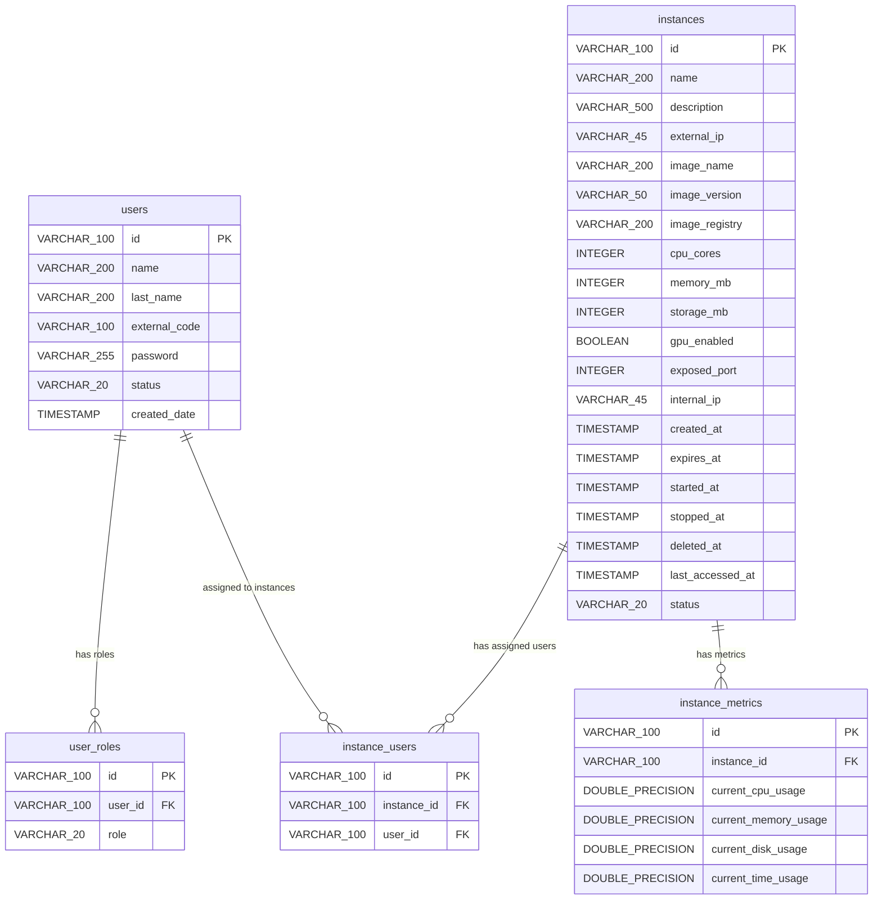

# Virtual Lab Platform — Database Schema

## Overview

The Virtual Lab Platform uses a relational database with five tables organized around two primary entities—**users** and **instances—and three supporting tables that capture roles, metrics, and the many-to-many association between users and instances. All primary keys are `VARCHAR(100)` strings generated at application level via the `UniqueIdGenerator` strategy. Every foreign key references the owning entity's primary key without ON DELETE cascades, meaning deletions must be handled explicitly by the application layer. Enumerated domains (`status`, `role`) are stored as `VARCHAR` with the Java enum constant names, persisted via JPA's `@Enumerated(EnumType.STRING)`.

## Entity Relationship Diagram

## Table Reference

### `users`

Stores platform user accounts with authentication metadata and lifecycle state.

| Column | Type | Nullable | Constraints | Default | JPA Mapping |
|---|---|---|---|---|---|
| `id` | `VARCHAR(100)` | NOT NULL | PRIMARY KEY | — | `UserJpa.id` → `User.id()` |
| `name` | `VARCHAR(200)` | NOT NULL | — | — | `UserJpa.name` → `User.name()` |
| `last_name` | `VARCHAR(200)` | NOT NULL | — | — | `UserJpa.lastName` → `User.lastName()` |
| `external_code` | `VARCHAR(100)` | NULL | — | — | `UserJpa.externalCode` → `User.externalCode()` (wrapped in `Optional`) |
| `password` | `VARCHAR(255)` | NOT NULL | — | — | `UserJpa.password` → `User.password()` |
| `status` | `VARCHAR(20)` | NOT NULL | — | — | `UserJpa.status` → `User.status()` (`@Enumerated(STRING)`: `ACTIVE`, `INACTIVE`) |
| `created_date` | `TIMESTAMP` | NOT NULL | — | `CURRENT_TIMESTAMP` | `UserJpa.createdDate` → `User.createdDate()` |

- **Module:** `virtual-lab-platform-users`
- **JPA Entity:** `UserJpa` (`edu.univalle.gadim.virtual_lab_platform.users.data.model`)
- **API Type Interface:** `User` (`edu.univalle.gadim.virtual_lab_platform.users.api.type`)

### `user_roles`

Maps users to their assigned roles, enforcing uniqueness on the `(user_id, role)` pair.

| Column | Type | Nullable | Constraints | Default | JPA Mapping |
|---|---|---|---|---|---|
| `id` | `VARCHAR(100)` | NOT NULL | PRIMARY KEY | — | `UserRoleJpa.id` → `UserRole.id()` |
| `user_id` | `VARCHAR(100)` | NOT NULL | FK → `users(id)`, UNIQUE with `role` | — | `UserRoleJpa.userId` → `UserRole.userId()` |
| `role` | `VARCHAR(20)` | NOT NULL | UNIQUE with `user_id` | — | `UserRoleJpa.role` → `UserRole.role()` (`@Enumerated(STRING)`: `ADMIN`, `STUDENT`, `TEACHER`) |

- **Module:** `virtual-lab-platform-users`
- **JPA Entity:** `UserRoleJpa` (`edu.univalle.gadim.virtual_lab_platform.users.data.model`)
- **API Type Interface:** `UserRole` (`edu.univalle.gadim.virtual_lab_platform.users.api.type`)

### `instances`

The central entity for virtual lab workspaces, tracking container configuration, lifecycle timestamps, and runtime status.

| Column | Type | Nullable | Constraints | Default | JPA Mapping |
|---|---|---|---|---|---|
| `id` | `VARCHAR(100)` | NOT NULL | PRIMARY KEY | — | `InstanceJpa.id` → `Instance.id()` |
| `name` | `VARCHAR(200)` | NOT NULL | — | — | `InstanceJpa.name` → `Instance.name()` |
| `description` | `VARCHAR(500)` | NULL | — | — | `InstanceJpa.description` → `Instance.description()` (wrapped in `Optional`) |
| `external_ip` | `VARCHAR(45)` | NULL | — | — | `InstanceJpa.externalIp` → `Instance.externalIp()` |
| `image_name` | `VARCHAR(200)` | NOT NULL | — | — | `InstanceJpa.imageName` → `Instance.imageName()` |
| `image_version` | `VARCHAR(50)` | NOT NULL | — | — | `InstanceJpa.imageVersion` → `Instance.imageVersion()` |
| `image_registry` | `VARCHAR(200)` | NULL | — | — | `InstanceJpa.imageRegistry` → `Instance.imageRegistry()` |
| `cpu_cores` | `INTEGER` | NOT NULL | — | — | `InstanceJpa.cpuCores` → `Instance.cpuCores()` |
| `memory_mb` | `INTEGER` | NOT NULL | — | — | `InstanceJpa.memoryMb` → `Instance.memoryMb()` |
| `storage_mb` | `INTEGER` | NOT NULL | — | — | `InstanceJpa.storageMb` → `Instance.storageMb()` |
| `gpu_enabled` | `BOOLEAN` | NOT NULL | — | — | `InstanceJpa.gpuEnabled` → `Instance.gpuEnabled()` |
| `exposed_port` | `INTEGER` | NULL | — | — | `InstanceJpa.exposedPort` → `Instance.exposedPort()` |
| `internal_ip` | `VARCHAR(45)` | NULL | — | — | `InstanceJpa.internalIp` → `Instance.internalIp()` |
| `created_at` | `TIMESTAMP` | NOT NULL | — | `CURRENT_TIMESTAMP` | `InstanceJpa.createdAt` → `Instance.createdAt()` |
| `expires_at` | `TIMESTAMP` | NULL | — | — | `InstanceJpa.expiresAt` → `Instance.expiresAt()` |
| `started_at` | `TIMESTAMP` | NULL | — | — | `InstanceJpa.startedAt` → `Instance.startedAt()` |
| `stopped_at` | `TIMESTAMP` | NULL | — | — | `InstanceJpa.stoppedAt` → `Instance.stoppedAt()` (wrapped in `Optional`) |
| `deleted_at` | `TIMESTAMP` | NULL | — | — | `InstanceJpa.deletedAt` → `Instance.deletedAt()` (wrapped in `Optional`) |
| `last_accessed_at` | `TIMESTAMP` | NULL | — | — | `InstanceJpa.lastAccessedAt` → `Instance.lastAccessedAt()` (wrapped in `Optional`) |
| `status` | `VARCHAR(20)` | NOT NULL | — | — | `InstanceJpa.status` → `Instance.status()` (`@Enumerated(STRING)`: `CREATED`, `STARTING`, `RUNNING`, `STOPPED`, `EXPIRED`, `DELETED`) |

- **Module:** `virtual-lab-platform-instances`
- **JPA Entity:** `InstanceJpa` (`edu.univalle.gadim.virtual_lab_platform.instances.data.model`)
- **API Type Interface:** `Instance` (`edu.univalle.gadim.virtual_lab_platform.instances.api.type`)

### `instance_metrics`

Stores point-in-time resource utilization snapshots for an instance.

| Column | Type | Nullable | Constraints | Default | JPA Mapping |
|---|---|---|---|---|---|
| `id` | `VARCHAR(100)` | NOT NULL | PRIMARY KEY | — | `InstanceMetricsJpa.id` → `InstanceMetrics.id()` |
| `instance_id` | `VARCHAR(100)` | NOT NULL | FK → `instances(id)` | — | `InstanceMetricsJpa.instanceId` → `InstanceMetrics.instanceId()` |
| `current_cpu_usage` | `DOUBLE PRECISION` | NULL | — | — | `InstanceMetricsJpa.currentCpuUsage` → `InstanceMetrics.currentCpuUsage()` |
| `current_memory_usage` | `DOUBLE PRECISION` | NULL | — | — | `InstanceMetricsJpa.currentMemoryUsage` → `InstanceMetrics.currentMemoryUsage()` |
| `current_disk_usage` | `DOUBLE PRECISION` | NULL | — | — | `InstanceMetricsJpa.currentDiskUsage` → `InstanceMetrics.currentDiskUsage()` |
| `current_time_usage` | `DOUBLE PRECISION` | NULL | — | — | `InstanceMetricsJpa.currentTimeUsage` → `InstanceMetrics.currentTimeUsage()` |

- **Module:** `virtual-lab-platform-instances`
- **JPA Entity:** `InstanceMetricsJpa` (`edu.univalle.gadim.virtual_lab_platform.instances.data.model`)
- **API Type Interface:** `InstanceMetrics` (`edu.univalle.gadim.virtual_lab_platform.instances.api.type`)

### `instance_users`

Join table establishing the many-to-many association between users and instances.

| Column | Type | Nullable | Constraints | Default | JPA Mapping |
|---|---|---|---|---|---|
| `id` | `VARCHAR(100)` | NOT NULL | PRIMARY KEY | — | `InstanceUserJpa.id` → `InstanceUser.id()` |
| `instance_id` | `VARCHAR(100)` | NOT NULL | FK → `instances(id)` | — | `InstanceUserJpa.instanceId` → `InstanceUser.instanceId()` |
| `user_id` | `VARCHAR(100)` | NOT NULL | FK → `users(id)` | — | `InstanceUserJpa.userId` → `InstanceUser.userId()` |

- **Module:** `virtual-lab-platform-instances`
- **JPA Entity:** `InstanceUserJpa` (`edu.univalle.gadim.virtual_lab_platform.instances.data.model`)
- **API Type Interface:** `InstanceUser` (`edu.univalle.gadim.virtual_lab_platform.instances.api.type`)

## Enumerated Domains

Enumerated columns are persisted as `VARCHAR` strings matching the Java enum constant names.

| DDL Column | Java Enum | Values |
|---|---|---|
| `users.status` | `UserStatus` | `ACTIVE`, `INACTIVE`, `DELETED` |
| `user_roles.role` | `Role` | `ADMIN`, `STUDENT`, `TEACHER` |
| `instances.status` | `InstanceStatus` | `CREATED`, `STARTING`, `RUNNING`, `STOPPED`, `EXPIRED`, `DELETED` |

## Constraints & Indexes

### Primary Keys

| Table | Column | Type |
|---|---|---|
| `users` | `id` | `VARCHAR(100)` |
| `user_roles` | `id` | `VARCHAR(100)` |
| `instances` | `id` | `VARCHAR(100)` |
| `instance_metrics` | `id` | `VARCHAR(100)` |
| `instance_users` | `id` | `VARCHAR(100)` |

### Foreign Keys

| From Table | From Column | To Table | To Column | Semantics |
|---|---|---|---|---|
| `user_roles` | `user_id` | `users` | `id` | A user has zero or more roles |
| `instance_metrics` | `instance_id` | `instances` | `id` | An instance has zero or more metric snapshots |
| `instance_users` | `instance_id` | `instances` | `id` | An instance has zero or more assigned users |
| `instance_users` | `user_id` | `users` | `id` | A user is assigned to zero or more instances |

### Unique Constraints

| Table | Columns | Semantics |
|---|---|---|
| `user_roles` | `(user_id, role)` | A user cannot hold the same role twice |

## Design Notes

- **Application-generated IDs:** All primary keys are `VARCHAR(100)` strings generated by the `UniqueIdGenerator` strategy (resolved at assembly time to `ObjectIdGenerator`), not by database auto-increment.
- **Soft deletes via lifecycle timestamps:** The `instances` table tracks deletion through `deleted_at` rather than physically removing rows. The `InstanceStatus.DELETED` enum value complements this pattern.
- **No ON DELETE cascades:** Foreign key constraints do not specify `ON DELETE CASCADE`. The application layer is responsible for cleaning up related rows (e.g., `user_roles`, `instance_users`, `instance_metrics`) when a parent entity is removed.
- **Nullable metric columns:** All metric value columns (`current_cpu_usage`, `current_memory_usage`, `current_disk_usage`, `current_time_usage`) and the instance lifecycle timestamp columns (`expires_at`, `started_at`, `stopped_at`, `deleted_at`, `last_accessed_at`) allow `NULL`, reflecting that these values are populated over the course of an instance's lifecycle.
- **No unique constraint on `instance_users`:** The `(instance_id, user_id)` pair is not constrained as unique by the DDL. Business-level enforcement of uniqueness is handled by the application layer in `InstanceUserService`.
- **No explicit indexes beyond PKs and the unique constraint:** The DDL does not define additional indexes. Query optimization may require indexes on `user_roles.user_id`, `instance_users.user_id`, `instance_users.instance_id`, and `instance_metrics.instance_id` as data volumes grow.