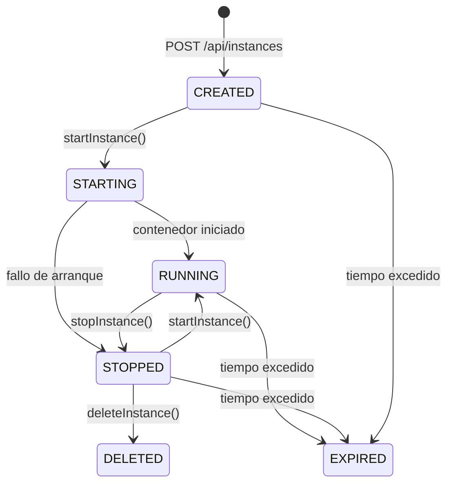
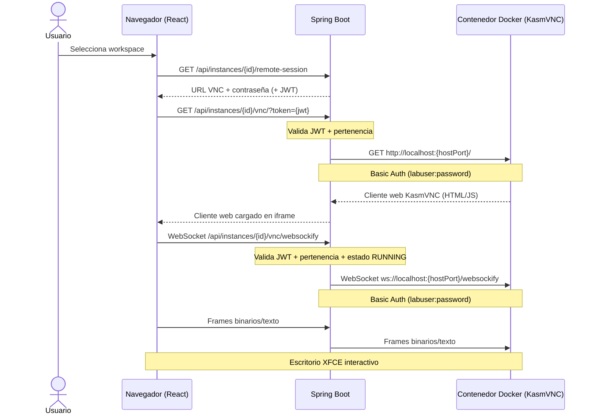

# Entorno Virtual de Laboratorio

## 1. Visión General

El entorno virtual permite a los usuarios acceder a escritorios Linux completos desde el navegador, ejecutándose dentro de contenedores Docker aislados en el servidor. Cada instancia es un contenedor Docker que incluye:

- Un escritorio XFCE completo
- Software especializado (KiCad, Vivado, Quartus Prime)
- Servidor KasmVNC para acceso remoto vía HTTP/WebSocket
- Almacenamiento persistente por usuario

El acceso es completamente remoto y basado en navegador: el usuario no necesita instalar ningún software cliente, solo un navegador web.

---

## 2. Ciclo de Vida de Instancias

### 2.1 Estados

Cada instancia pasa por los siguientes estados de vida:

```
CREATED ──► STARTING ──► RUNNING ──► STOPPED ──► DELETED
                            │           │
                            └──► EXPIRED │
                                         │
                            (cualquier)──► EXPIRED
```

| Estado | Significado |
|--------|-------------|
| `CREATED` | Instancia creada y contenedor Docker en ejecución, pero aún no confirmada |
| `STARTING` | Contenedor está arrancando (estado transitorio) |
| `RUNNING` | Contenedor funcionando y accesible (incluyendo VNC) |
| `STOPPED` | Contenedor detenido (puede arrancarse de nuevo) |
| `EXPIRED` | Instancia excedió su tiempo de expiración (7 días por defecto) |
| `DELETED` | Borrado lógico: el registro permanece en base de datos pero se filtra de todas las consultas |

### 2.2 Transiciones y Reglas

| Transición | Descripción | Reglas |
|------------|-------------|--------|
| Crear | Se genera un ID único, una contraseña VNC aleatoria (12 caracteres), se construye el contenedor Docker y se persiste la instancia | La imagen Docker se construye automáticamente si no existe localmente |
| Iniciar | Arranca un contenedor detenido | Rechazado si la instancia está `DELETED`. Si ya está `RUNNING`, se retorna sin cambios (idempotente). Si falla el arranque, vuelve a `STOPPED` |
| Detener | Detiene el contenedor Docker | Rechazado si `DELETED`. Si ya está `STOPPED`, se retorna sin cambios |
| Eliminar | Borrado lógico de la instancia | Requiere que esté en estado `STOPPED` (si no, retorna HTTP 409 Conflict) |
| Expirar | Marca instancias que exceden `expiresAt` | No hay tarea programada automática actualmente |

### 2.3 Diagrama de Estados



---

## 3. Catálogo de Workspaces

Los tipos de workspace se definen en `application.yml` bajo `workspace.catalog.images`. Cada imagen especifica el software que incluye y los recursos por defecto para el contenedor.

### 3.1 Imágenes Disponibles

| ID | Nombre | Categoría | Imagen Docker | CPU | RAM | Almacenamiento |
|----|--------|-----------|---------------|-----|-----|----------------|
| `kicad` | KiCad | EDA | `lab-kicad:latest` | 2 cores | 4096 MB | 10240 MB |
| `vivado` | Vivado | FPGA | `lab-vivado:2023.2` | 4 cores | 8192 MB | 20480 MB |
| `quartus` | Quartus Prime | FPGA | `lab-quartus:22.1` | 4 cores | 8192 MB | 20480 MB |

### 3.2 Endpoints del Catálogo

| Método | Ruta | Descripción |
|--------|------|-------------|
| `GET` | `/api/catalog/images` | Lista todas las imágenes de workspace disponibles |
| `GET` | `/api/catalog` | Catálogo completo con conteo de instancias activas por imagen |

---

## 4. Aprovisionamiento de Contenedores

### 4.1 Flujo de Creación

1. El usuario envía `POST /api/instances` con el ID de imagen, nombre y recursos deseados
2. El servicio genera un ID único y una contraseña VNC aleatoria de 12 caracteres
3. Se verifica que la imagen Docker existe; si no, se construye con `docker build`
4. Se crea el contenedor Docker con:
   - **Límites de CPU**: `cpuQuota = cores * 100000`, `cpuPeriod = 100000` (CFS quota)
   - **Límite de RAM**: configurado en bytes con swap deshabilitado (swap = memoria)
   - **Memoria compartida**: 2 GB (`shmSize`) requerida por el framebuffer de KasmVNC
   - **Seguridad**: `--security-opt=no-new-privileges:true`
   - **Volumen persistente**: `vol_{userId}` montado en `/home/labuser/projects`
   - **Puerto VNC**: bind dinámico del puerto 6901 del contenedor a un puerto aleatorio del host
   - **Variable de entorno**: `KASMVNC_PASSWORD` para configurar el acceso VNC
5. Se inicia el contenedor inmediatamente
6. Se resuelve el puerto VNC del host y la IP interna del contenedor vía `docker inspect`
7. Se persiste la instancia en base de datos

### 4.2 Recursos

| Campo | Descripción | Por defecto |
|-------|-------------|-------------|
| `cpuCores` | Núcleos de CPU asignados al contenedor | Desde el catálogo |
| `memoryMb` | RAM en MB | Desde el catálogo |
| `storageMb` | Almacenamiento (informativo, no es límite de disco) | Desde el catálogo |
| `gpuEnabled` | Si se habilita aceleración GPU (no implementado) | `false` |

### 4.3 Persistencia de Datos

Los datos del usuario se preservan mediante volúmenes Docker nombrados:

- Formato: `vol_{sanitizedUserId}`
- Montaje: `/home/labuser/projects` dentro del contenedor
- Alcance: **un volumen por usuario**, compartido entre todas sus instancias

Esto significa que los archivos guardados en un workspace de KiCad estarán disponibles si el mismo usuario crea una nueva instancia.

---

## 5. Acceso Remoto (VNC)

### 5.1 Arquitectura General

```
┌──────────────┐     ┌─────────────────┐     ┌──────────────────────┐
│  Navegador   │────►│  Spring Boot     │────►│  Contenedor Docker   │
│  (React SPA) │     │  (Proxy VNC)     │     │  (KasmVNC + XFCE)    │
└──────────────┘     └─────────────────┘     └──────────────────────┘
    iframe HTML        HTTP Reverse Proxy         KasmVNC en :6901
    + WebSocket        + WebSocket Proxy          + escritorio Linux
```

### 5.2 Componentes del Proxy

| Componente | Protocolo | Ruta | Función |
|------------|-----------|------|---------|
| `VncProxyController` | HTTP | `/api/instances/{id}/vnc/**` | Proxy inverso HTTP: carga el cliente web KasmVNC, autentica con JWT, reenvía peticiones al contenedor con Basic Auth |
| `VncWebSocketProxyHandler` | WebSocket | `/api/instances/*/vnc/websockify` | Proxy WebSocket bidireccional: reenvía frames entre el navegador y el servidor KasmVNC |
| `VncWebSocketConfig` | Configuración | — | Registra el handler WebSocket, captura la sesión de Spring Security para autenticación |

### 5.3 Flujo Completo de Conexión



### 5.4 Imagen Docker

La imagen base es Ubuntu 24.04 e incluye:

- Escritorio XFCE4 completo
- KasmVNC v1.4.0 (servidor VNC con cliente web HTML5)
- KiCad EDA (software de diseño electrónico)
- Usuario `labuser` con permisos para ejecutar el servidor VNC

Configuración de KasmVNC (`kasmvnc.yaml`):
- Resolución: 1920×1080, redimensionable, color 24-bit
- Protocolo: HTTP (sin SSL), puerto 6901
- WebSocket en el mismo puerto
- Máximo 60 fps, portapapeles bidireccional
- Sin timeout de inactividad
- Protección anti fuerza bruta deshabilitada (entorno de laboratorio)

---

## 6. Métricas

El sistema de métricas funciona por **envío push**: un agente externo (o el propio contenedor) envía periódicamente snapshots de uso al backend.

### 6.1 Datos Recolectados

| Métrica | Rango | Descripción |
|---------|-------|-------------|
| `currentCpuUsage` | 0.0–1.0 | Uso de CPU normalizado |
| `currentMemoryUsage` | 0.0–1.0 | Uso de memoria normalizado |
| `currentDiskUsage` | 0.0–1.0 | Uso de disco normalizado |
| `currentTimeUsage` | segundos | Tiempo de uso acumulado |

### 6.2 Endpoints de Métricas

| Método | Ruta | Descripción |
|--------|------|-------------|
| `POST` | `/api/instances/{instanceId}/metrics` | Registra una nueva instantánea de métricas |
| `GET` | `/api/instances/{instanceId}/metrics` | Obtiene todas las métricas registradas de una instancia |

---

## 7. Endpoints REST (Resumen)

### 7.1 Instancias

| Método | Ruta | Descripción | Auth |
|--------|------|-------------|------|
| `POST` | `/api/instances` | Crear nueva instancia | JWT |
| `GET` | `/api/instances/{id}` | Obtener instancia por ID | JWT |
| `GET` | `/api/instances` | Listar instancias del usuario | JWT |
| `POST` | `/api/instances/{id}/start` | Iniciar instancia detenida | JWT |
| `POST` | `/api/instances/{id}/stop` | Detener instancia en ejecución | JWT |
| `DELETE` | `/api/instances/{id}` | Borrado lógico (requiere STOPPED) | JWT |

### 7.2 Sesión Remota

| Método | Ruta | Descripción | Auth |
|--------|------|-------------|------|
| `GET` | `/api/instances/{id}/remote-session` | Metadatos de sesión (URL VNC, estado) | JWT + pertenencia |
| `DELETE` | `/api/instances/{id}/remote-session` | Terminar sesión (detiene instancia) | JWT |
| `GET` | `/api/instances/{id}/remote-session/status` | Verificación de salud VNC | JWT + pertenencia |

### 7.3 Proxy VNC

| Método | Ruta | Descripción | Auth |
|--------|------|-------------|------|
| `GET` | `/api/instances/{id}/vnc/**` | Proxy HTTP al cliente web KasmVNC | JWT + pertenencia |
| `WS` | `/api/instances/*/vnc/websockify` | Proxy WebSocket al servidor KasmVNC | JWT + pertenencia |

### 7.4 Catálogo

| Método | Ruta | Descripción | Auth |
|--------|------|-------------|------|
| `GET` | `/api/catalog/images` | Listar imágenes de workspace | JWT |
| `GET` | `/api/catalog` | Catálogo con conteo de instancias activas | JWT |

### 7.5 Métricas

| Método | Ruta | Descripción | Auth |
|--------|------|-------------|------|
| `POST` | `/api/instances/{id}/metrics` | Registrar métricas | JWT |
| `GET` | `/api/instances/{id}/metrics` | Obtener métricas | JWT |

---

## 8. Base de Datos

### 8.1 Tabla `instances`

| Columna | Tipo | Descripción |
|---------|------|-------------|
| `id` | VARCHAR(100) | PK generada |
| `name` | VARCHAR(255) | Nombre descriptivo |
| `description` | VARCHAR(500) | Descripción (nullable) |
| `status` | VARCHAR(20) | Estado (CREATED, STARTING, RUNNING, STOPPED, EXPIRED, DELETED) |
| `external_ip` | VARCHAR(64) | ID del contenedor Docker |
| `internal_ip` | VARCHAR(45) | IP interna del contenedor en red bridge |
| `vnc_port` | INTEGER | Puerto VNC en el host |
| `vnc_password` | VARCHAR(64) | Contraseña VNC |
| `vnc_enabled` | BOOLEAN | Si VNC está habilitado |
| `image_name` | VARCHAR(255) | Nombre de imagen Docker |
| `image_version` | VARCHAR(32) | Versión de imagen Docker |
| `cpu_cores` | INTEGER | Núcleos CPU asignados |
| `memory_mb` | INTEGER | RAM en MB |
| `storage_mb` | INTEGER | Almacenamiento en MB |
| `exposed_port` | INTEGER | Puerto de aplicación expuesto |
| `gpu_enabled` | BOOLEAN | Si GPU está habilitada |
| `created_at` | TIMESTAMP | Fecha de creación |
| `started_at` | TIMESTAMP | Fecha de último inicio (nullable) |
| `stopped_at` | TIMESTAMP | Fecha de última detención (nullable) |
| `expires_at` | TIMESTAMP | Fecha de expiración |
| `deleted_at` | TIMESTAMP | Fecha de borrado lógico (nullable) |

### 8.2 Tabla `instance_metrics`

| Columna | Tipo | Descripción |
|---------|------|-------------|
| `id` | VARCHAR(100) | PK generada |
| `instance_id` | VARCHAR(100) | FK → instances(id) |
| `current_cpu_usage` | DOUBLE | Uso CPU (0.0–1.0) |
| `current_memory_usage` | DOUBLE | Uso memoria (0.0–1.0) |
| `current_disk_usage` | DOUBLE | Uso disco (0.0–1.0) |
| `current_time_usage` | DOUBLE | Tiempo de uso en segundos |

### 8.3 Tabla `instance_users`

| Columna | Tipo | Descripción |
|---------|------|-------------|
| `id` | VARCHAR(100) | PK generada |
| `instance_id` | VARCHAR(100) | FK → instances(id) |
| `user_id` | VARCHAR(255) | FK → users(id) (email institucional) |

---

## 9. Consideraciones de Diseño

1. **`externalIp` almacena el ID del contenedor Docker**, no una IP real (nombrado heredado)
2. **Puerto VNC dinámico**: el puerto 6901 del contenedor se mapea a un puerto aleatorio del host, resuelto vía `docker inspect`
3. **Volúmenes por usuario**: un solo volumen persistente por usuario (`vol_{userId}`) compartido entre todas sus instancias
4. **Borrado lógico**: las instancias nunca se eliminan físicamente; pasan a estado `DELETED` y se filtran de todas las consultas
5. **Imagen auto-construida**: si la imagen Docker no existe localmente, se construye automáticamente desde `virtual-lab-platform-instances/docker/kicad/`
6. **Sin expiración automática**: el estado `EXPIRED` existe pero no hay tarea programada que lo aplique
7. **Autenticación JWT por query string**: los tokens se aceptan tanto por header `Authorization` como por parámetro `?token=`, necesario para autenticar el iframe del cliente VNC y la conexión WebSocket
8. **Patrón WsOps**: los controladores delegan en interfaces `*WsOps` → implementaciones `*SpringWsOps` → servicios → operaciones, manteniendo 5 capas de separación
